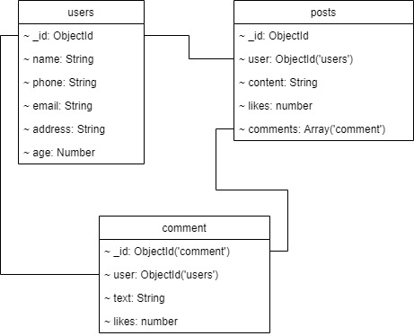

# Antroji Nereliacinų duomenų bazių kurso užduotis
---
Scriptui paleisti reikia: 
* Node.js/NPM;
* MongoDB su defaultiniais connectiono parametrais `localhost:27017` bei neapsaugotu slaptažodžiu;
  
# Dokumentų modelis
---

# Dokumentų generavimas
---
Informacija, esanti dokumentuose generuojama `faker.js` bibliotekos pagalba.

Duomenų generavimui atkomentuokite 132-ą index.js eilutę.

Scriptas paleidžiamas komanda `node index.js`